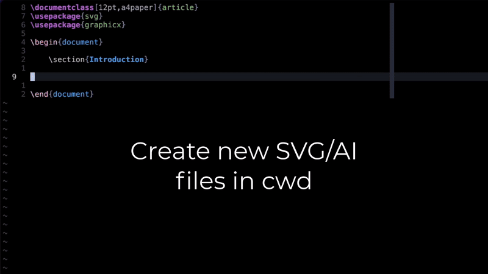

<h1 align="center">🎨 Illustrate</h1>

<p align="center">


Illustrate is a lua plugin for neovim that lets you to quickly create and
manage vector documents within neovim. It works in LaTeX and Markdown files,
using both Inkscape (Linux, macOS) and Adobe Illustrator (macOS).



</p>

With key bindings you define, `illustrate` can:

* Create a new `.svg` or `.ai` file in your current working directory,
  insert code snippet (tex/md) and open the vector document in Inkscape / Adobe Illustrator.
* Using [telescope](https://github.com/nvim-telescope/telescope.nvim) you can search through the
  available `.svg` and `.ai` documents in your current working directory and
  open them in Inkscape / Adobe Illustrator.

The plugin is currently only supporting macOS and Linux, however I am open to
support Windows and happy to merge request. I just don't have a Windows machine
to test it.

## Installation

Currently the plugin is written for lazy.nvim. However, I am happy to consider
other plugin managers and support them (feel free to open a pull request; happy
to merge it).

### lazy.nvim

```lua
return { 
    'rpapallas/illustrate.nvim',
    keys = function()
        local illustrate = require('illustrate')
        local illustrate_finder = require('illustrate.finder')
        return {
            {"<leader>vs", function() illustrate.create_and_open_svg() end, desc ="create new .svg file, open it in default app and insert code in document."},
            {"<leader>va", function() illustrate.create_and_open_ai() end, desc ="craete new .ai file, open it in default app and insert code in document."},
            {"<leader>vf", function() illustrate_finder.search_and_open() end, desc ="search for illustration files in current directory and open selected one in default app."},
        }
    end,
    opts = {
        -- optionally define options.
    },
}
```

The default options (that you can override in `opts`) are:

```lua
    illustration_dir = "figures",
    template_files = { -- Templates used when new vector documents are created.
        -- You can optionally define a path to your own template dir and
        -- bootstrap your documents with a better template than an empty 
        -- canvas. 
        directory = {
            svg = templates_dir .. "/svg/",
            ai = templates_dir .. "/ai/",
        },
        default = {
            svg = "default.svg",
            ai = "default.ai",
        }
    },
    text_templates = { -- Default code template for each vector type (svg/ai) and each document (tex/md)
        svg = {
            tex = [[
\begin{figure}[h]
  \centering
  \includesvg[width=0.8\textwidth]{$FILE_PATH}
  \caption{Caption}
  \label{fig:}
\end{figure}
            ]],
            md = "",
        },
        ai = {
            tex = [[
\begin{figure}[h]
  \centering
  \includegraphics[width=0.8\linewidth]{$FILE_PATH}
  \caption{Caption}
  \label{fig:}
\end{figure}
            ]],
        }
    },
    default_app = { -- default software to use for opening ai/svg files.
        svg = "inkscape", -- Options: inkscape/illustrator
        ai = "inkscape", -- Options: inkscape/illustrator
    },
```

## Using `.svg` and `.ai` files directly in LaTeX

You can use `.svg` file directly in LaTeX given that you have inkscape 
installed. You can then use `\includesvg[\linewidth]{figures/figure.svg}`.

To use `.ai` files directly, however, you need to put the following line in your
LaTeX project:

```tex
\DeclareGraphicsRule{.ai}{pdf}{.ai}{}
```

then you can include it like so: `\includegraphics[\linewidth]{figures/figure.ai}`.

## Contributions, feedback and requests

Happy to accept contributions/pull requests to extend and improve this simple 
plugin. Also open to feedback and requests for new features. Please open a 
GitHub issue for those.

## Features

The following features are on the horizon. If you think you can help, I would
be happy to accept and merge your pull request!

- [ ] Telescope to show preview of svg files.
- [ ] Allow opening of a figure under cursor (or while cursor within a figure environment).
- [ ] Implement the functionalities for Microsoft Windows.
- [ ] Implement support for Adobe Illustrator on Linux (?). Not sure if Illustrator is runnable on Linux.

## Other notes

* This is my first neovim plugin and the first time I write a lua code (any feedback is appreciated).
* This plugin is inspired from [this](https://github.com/gillescastel/inkscape-figures) Python project from [Gilles Castel](https://github.com/gillescastel) and his excellent blog post [here](https://castel.dev/post/lecture-notes-2/), but extended to support Adobe Illustrator on top of Inkscape and be a native lua plugin for neovim.
* The structure of this repo is based on [nvim-plugin-template](https://github.com/mistricky/nvim-plugin-template)

