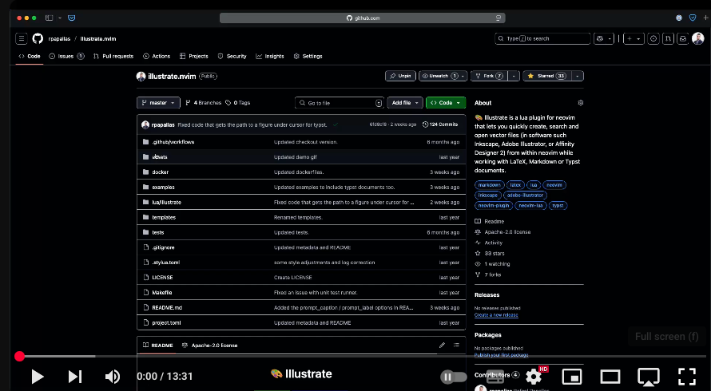

<h1 align="center">🎨 Illustrate</h1>

<p align="center">


<br/>
<a href="https://github.com/rpapallas/illustrate.nvim/actions/workflows/default.yaml/badge.svg" alt="GitHub Actions">

</a>

Illustrate is a lua plugin for neovim that lets you quickly create, search
and open vector files in different vector software from within neovim. It works
with LaTeX, Markdown and Typst files.

The supported vector software includes:

* Inkscape (Linux, macOS)
* Adobe Illustrator (macOS)
* Affinity Designer 2 (macOS)

> [!note]
> As Illustrate opens Inkscape via the CLI interface, and Inkscape installed via the [official download page](https://inkscape.org/release/inkscape-dev/?latest=1) seems to not configure it for you, it's recommended to install Inkscape via Homebrew as CLI is available out of the box.

### YouTube Video - Walk-through/tutorial (click to watch)

[](https://www.youtube.com/watch?v=FHtoGKyml7k)

</p>

## Features

| Feature                                           | Details                                                                                                                                                                                                                    |
|---------------------------------------------------|----------------------------------------------------------------------------------------------------------------------------------------------------------------------------------------------------------------------------|
| `illustrate.create_and_open_svg()`                | Creates a new `svg` file with a name of your choice, inserts a template code snippet (LaTeX/Markdown/Typst) in your current buffer and opens the SVG file in the default app (Inkscape or Adobe Illustrator).                    |
| `illustrate.create_and_open_ai()`                 | Creates a new `ai` (Adobe Illustrator) file with a name of your choice, inserts a template code snippet (LaTeX/Markdown/Typst) in your current buffer and opens the SVG file in the default app (Inkscape or Adobe Illustrator). |
| `illustrate.open_under_cursor()`                  | Searches for a figures environment (LaTeX/Markdown/Typst) under your cursor and opens that figure in default app (Inkscape / Adobe Illustrator). If the figure is missing it will offer the option to create it.               |
| `illustrate_finder.search_and_open()`             | Using [telescope](https://github.com/nvim-telescope/telescope.nvim) it will show all `svg` and `ai` files and will open the selected one in the default app (Inkscape or Adobe Illustrator).                               |
| `illustrate_finder.search_create_copy_and_open()` | Using [telescope](https://github.com/nvim-telescope/telescope.nvim) it will show all `svg` and `ai` files, offer to copy one with a new name, and open the new clone in the default app (Inkscape or Adobe Illustrator).   |

The plugin currently supports macOS and Linux only, but I am open to add
support for Windows too. I am happy to accept pull requests on this matter, I
just don't have a Windows machine to develop/test it.

## Installation

<details>
<summary>lazy.nvim</summary>

```lua
return {
'rpapallas/illustrate.nvim',
dependencies = {
    'nvim-lua/plenary.nvim',
    'nvim-telescope/telescope.nvim',
},
keys = function()
    local illustrate = require('illustrate')
    local illustrate_finder = require('illustrate.finder')

    return {
        {
            "<leader>is",
            function() illustrate.create_and_open_svg() end,
            desc = "Create and open a new SVG file with provided name."
        },
        {
            "<leader>ia",
            function() illustrate.create_and_open_ai() end,
            desc = "Create and open a new Adobe Illustrator file with provided name."
        },
        {
            "<leader>io",
            function() illustrate.open_under_cursor() end,
            desc = "Open file under cursor (or file within environment under cursor)."
        },
        {
            "<leader>if",
            function() illustrate_finder.search_and_open() end,
            desc = "Use telescope to search and open illustrations in default app."
        },
        {
            "<leader>ic",
            function() illustrate_finder.search_create_copy_and_open() end,
            desc = "Use telescope to search existing file, copy it with new name, and open it in default app."
        },
    }
end,
opts = {
    -- optionally define options. Look at the "Default Config File Example"
    -- under "Configuration" in the GitHub README.
},
}
```
</details>

<details>
<summary>vim-plug</summary>

```lua
local vim = vim
local Plug = vim.fn['plug#']

vim.call('plug#begin')
    Plug 'rpapallas/illustrate.nvim'
    Plug 'nvim-lua/plenary.nvim'
    Plug 'nvim-telescope/telescope.nvim'
vim.call('plug#end')

local illustrate = require('illustrate')
local illustrate_finder = require('illustrate.finder')
vim.keymap.set('n', '<leader>is', function() illustrate.create_and_open_svg() end, {})
vim.keymap.set('n', '<leader>ia', function() illustrate.create_and_open_ai() end, {})
vim.keymap.set('n', '<leader>io', function() illustrate.open_under_cursor() end, {})
vim.keymap.set('n', '<leader>if', function() illustrate_finder.search_and_open() end, {})
vim.keymap.set('n', '<leader>ic', function() illustrate_finder.search_create_copy_and_open() end, {})
```

Note the dependencies above (`plenary`, and `telescope`).
Make sure to run `:PlugInstall`. Everything should work out of the box.
</details>

<details>
<summary>packer</summary>

```lua
vim.cmd [[packadd packer.nvim]]

return require('packer').startup(function(use)
    use 'rpapallas/illustrate.nvim'
    use 'wbthomason/packer.nvim'
    use 'nvim-lua/plenary.nvim'
    use 'nvim-telescope/telescope.nvim'
end)
```

</details>

## Configuration

The plugin is customisable. The plugin offers the following options.
For example, if you are using lazy.nvim, you can
overwrite these options by adding them as key-value pairs in the
`opts = { ... }` (see installation above).

| Config                                              | Purpose                                                                                                                                                                                                                                                                                                 |
|-----------------------------------------------------|---------------------------------------------------------------------------------------------------------------------------------------------------------------------------------------------------------------------------------------------------------------------------------------------------------|
| `illustration_dir`                                  | The name of the directory to save figures in; defaults to `figures`.                                                                                                                                                                                                                                    |
| `directories_to_avoid_creating_illustration_dir_in` | Sub-directory names to *avoid* creating an `illustration_dir` in. When an `illustration_dir` isn't found in cwd or parent directory, the plugin will attempt to create one in the best place possible. By default it will avoid `sections` and `chapters` and it will create one in a parent directory. |
| `prompt_caption`                                    | This will prompt the user after the creation of a new figure (latex/typst) to also provide a caption for the figure. Defaults to `false`, set to `true` manually if you want this feature. |
| `prompt_label`                                      | This will prompt the user after the creation of a new figure (latex/typst) to also provide a label for the figure. Defaults to `false`, set to `true` manually if you want this feature. |
| `template_files`                                    | Points to directories where template files are stored.                                                                                                                                                                                                                                                  |
| `text_templates`                                    | Template LaTeX, Markdown or Typst code to insert into the document on the creation of a new figure.                                                                                                                                                                                                            |
| `default_app`                                       | Defines which app to use to open `svg` or `ai` files: `inkscape`, `illustrator`, or `affinity2`).                                                                                                                                                                                                            |


<details>
<summary>Default Config File Example</summary>

You can overwrite default settings by setting the following:

```lua
illustration_dir = "figures",
directories_to_avoid_creating_illustration_dir_in = {
    'sections',
    'chapters',
},
prompt_caption = false,
prompt_label = false,
template_files = { -- Templates used when new vector documents are created.
    -- You can optionally define a path to your own template dir and
    -- bootstrap your documents with a better template than an empty
    -- canvas.
    directory = {
        svg = templates_dir .. "/svg/",
        ai = templates_dir .. "/ai/",
    },
    default = {
        svg = "default.svg",
        ai = "default.ai",
    }
},
text_templates = { -- Default code template for each vector type (svg/ai) and each document (tex/md)
    svg = {
        tex = [[
\begin{figure}[h]
  \centering
  \includesvg[width=0.8\textwidth]{$FILE_PATH}
  \caption{Caption}
  \label{fig:}
\end{figure}
            ]],
        md = "",
        typ = [[
#figure(
  image("$FILE_PATH", width: 80%),
  caption: [$CAPTION]
) <$LABEL>
            ]]
    },
    ai = {
        tex = [[
\begin{figure}[h]
  \centering
  \includegraphics[width=0.8\linewidth]{$FILE_PATH}
  \caption{Caption}
  \label{fig:}
\end{figure}
            ]],
        md = "",
        typ = [[
#figure(
  image("$FILE_PATH", width: 80%),
  caption: [$CAPTION]
) <$LABEL>
            ]]
    }
},
default_app = { -- default software to use for opening ai/svg files.
    svg = "inkscape", -- Options: inkscape/illustrator/affinity2
    ai = "inkscape", -- Options: inkscape/illustrator/affinity2
},
```

</details>

## Using `.svg` and `.ai` files directly in LaTeX

You can use `.svg` file directly in LaTeX given that you have inkscape
installed. You can then use `\includesvg[\linewidth]{figures/figure.svg}`.
Make sure to include `--shell-escape` when you compile
(e.g. `lualatex --shell-escape main.tex ...`).

To use `.ai` files directly, however, you need to put the following line in your
LaTeX project:

```tex
\DeclareGraphicsRule{.ai}{pdf}{.ai}{}
```

then you can include it like so: `\includegraphics[\linewidth]{figures/figure.ai}`.

You can see example projects [here](examples/).

## LaTeX Examples

You may be interested in using this plugin with different project structure.
For example, you may want to have a figures directory for each chapter/section
in your latex project. You can see different use cases of this plugin in the
examples directory [here](examples/). In all examples you can use `make` to
build the document and `make clean` to delete compiled artifacts.

### Example 0 - Flat project

This is the simplest structure, you have a single directory where all of your
LaTeX documents live in, and you have a single figures directory:

```
.
├── Makefile
└── main.tex
```

If you edit `main.tex`, illustrate.nvim will create a `figures` directory the
next time you attempt to create a new figure, if a `figures` directory does not
already exists.


### Example 1 - Chapters with a figures directory already in root

The example is a latex document where main content is split into chapters
and sections. Each chapter has its own directory (`chapters/chapter_name`) that
hosts all its sections. The project has a `figures` directory already in the
root (created by the user):

```
.
├── Makefile
├── chapters/
│   └── introduction/
│       ├── introduction.tex
│       └── objectives.tex
├── figures/
└── main.tex
```

illustrate.nvim will find the existence of `figures` in the root directory and
save all figures (despite where you are in the project) in there. You may
be editing `chapters/introduction/objectives.tex` (cwd is root), or you may
be editing `objectives.tex` (cwd is `chapters/introduction`), illustrate.nvim
will save the figures in the `figures` directory that already exists in the
root directory.

### Example 2 - Chapters without a figures directory anywhere

In this example, the project does not include a `figures` directory:

```
.
├── Makefile
├── chapters/
│   └── introduction/
│       ├── introduction.tex
│       └── objectives.tex
└── main.tex
```

illustrate.nvim will attempt to create one in the root directory the next
time you try to create a new figure, anywhere in the project. For example,
you can `cd chapters/introduction` and edit `objectives.tex`. You can invoke
illustrate.nvim to create a new SVG file. The plugin should create a new `figures`
directory under the root directory and save the new figure there.

illustrate.nvim uses the `directories_to_avoid_creating_illustration_dir_in` in
the config to find which directories to avoid creating a new `figures`
directory in. By default, if a `figures` directory isn't found anywhere in the
path, it will avoid creating a new `figures` directory in `chapters` or
`sections` directories, and will attempt to create one in a parent directory.
You can add to that list any directory names you want to avoid creating a new
figures directory in in your config.

### Example 3 - Chapters with their own figures directory

In this example, the project includes a `figures` directory, but not
in the root. Each chapter has its own `figures` directory. For this example to work,
the user has to create the `figures` directories (even empty) inside each directory
of the `chapters` directory manually.

```
.
├── Makefile
├── chapters/
│   ├── introduction/
│   │   ├── figures/
│   │   ├── introduction.tex
│   │   └── objectives.tex
│   └── literature_review/
│       ├── figures/
│       └── literature_review.tex
└── main.tex
```

If you are working on file `objectives.tex` of the introduction chapter but
you current working directory is the root directory, any figures you attempt
to create using illustrate.nvim will be created inside the `figures` of the
introduction chapter. illustrate.nvim should also make sure to put the right
relative path in the figure environment in LaTeX to make this to work.

## Contributions, feedback and requests

Happy to accept contributions/pull requests to extend and improve this simple
plugin. I am also open to feedback and requests for new features. Please open a
GitHub issue for those.

## Other notes

* This plugin is inspired from [this](https://github.com/gillescastel/inkscape-figures) Python project from [Gilles Castel](https://github.com/gillescastel) and his excellent blog post [here](https://castel.dev/post/lecture-notes-2/), but extended to support Adobe Illustrator and be a native lua plugin for neovim.

